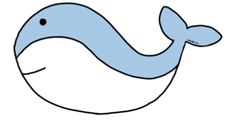

# Badaboum
codewear study 11회차 음악공유 플랫폼입니다. 

### 개발 진행 일정
2020.06.29 ~ 2020.07.18

### 역할 분담
- client : [Loin][https://github.com/loin3], [Kuma][https://github.com/Parkhyunseo]
- backend : [HodaeSsi][https://github.com/HodaeSsi], [Judy][https://github.com/mywnajsldkf]

### 사용한 기술
- backend
    - server : flask
    - Database : mysql
    - 배포 : Heroku